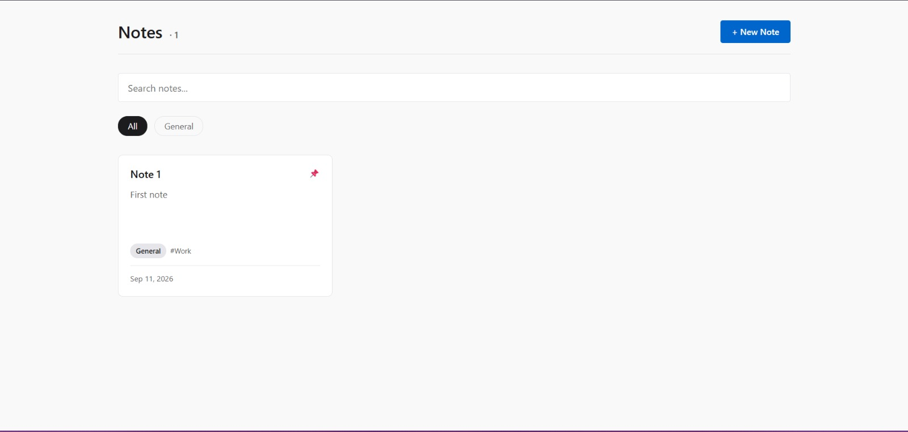

# Notes App

A minimal full-stack notes application built with the MERN stack.

## Features

- Create, edit and delete notes
- Search notes by title, content, tags, or category
- Category filtering
- Tags
- Pin notes
- Responsive interface
- MongoDB persistence
- REST API

## Tech Stack

Frontend:
- React
- Vite
- Axios

Backend:
- Node.js
- Express
- Mongoose

Database:
- MongoDB

## Project Structure

- `client/`: Contains the React + Vite frontend application.
- `server/`: Contains the Node.js + Express backend application.

## Getting Started

### Prerequisites
- Node.js (v18+)
- MongoDB (local or Atlas)

### Local Setup

1. Clone repository
```bash
git clone https://github.com/yourusername/notes-app.git
cd notes-app
```

2. Install backend dependencies
```bash
cd server
npm install
```

3. Install frontend dependencies
```bash
cd ../client
npm install
```

4. Create environment files
Copy the example files and update them with your local configuration:

In the `server` directory:
```bash
cp .env.example .env
```

In the `client` directory:
```bash
cp .env.example .env
```

5. Start backend
From the `server` directory:
```bash
npm run dev
```

6. Start frontend
From the `client` directory:
```bash
npm run dev
```

## Environment Variables

### `server/.env`
- `PORT`: Port for the Express server (default: 5000)
- `MONGODB_URI`: MongoDB connection string

### `client/.env`
- `VITE_API_URL`: URL of the backend API (default: http://localhost:5000)

## API Endpoints

- `GET /api/health` - Check API health
- `GET /api/notes` - Fetch all notes
- `GET /api/notes/:id` - Fetch a specific note
- `POST /api/notes` - Create a new note
- `PUT /api/notes/:id` - Update an existing note
- `DELETE /api/notes/:id` - Delete a note

## Screenshots

### Notes overview


### Note editor


*(Note: Add screenshot images to the `screenshots/` directory manually.)*

## Future Improvements

- Authentication
- Rich text support
- Note sharing

## License

MIT
